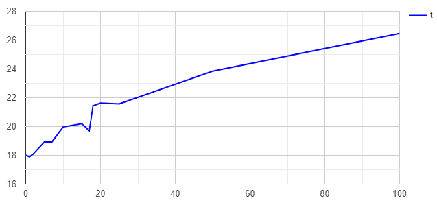
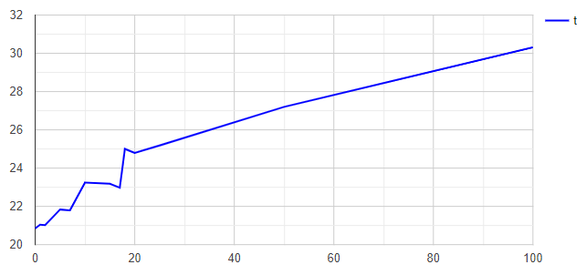
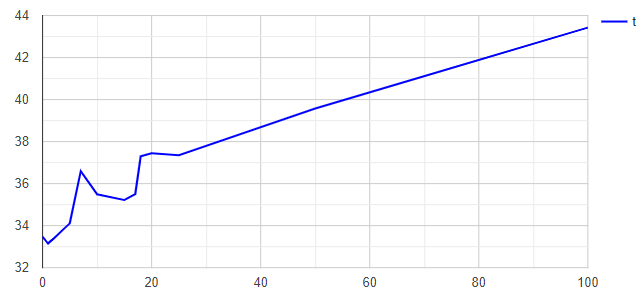

# Esercizio 1
L'esercizio richiede lo sviluppo di una libreria che consenta di ordinare, attraverso l'algoritmo di ordinamento merge binary insertion sort, degli oggetti generici. Si richiede anche un'applicazione che implementi tale libreria che regoli tramite un parametro k il grado di ibridazione del merge binary insertion sort.

# Disposizione in cartelle
La cartella corrente di questa repository contiene le seguenti cartelle:
- lib: contiene la libreria sviluppata
- misc: contiene alcune funzioni di comparazione (utilizzate negli unit test)
- main: contiene il sorgente di un'applicazione della libreria
- bin: contiene il codice compilato dopo l'esecuzione del makefile
- unit_test: contiene la libreria unity per test di unità, un sorgente che implementa la libreria, un makefile per compilare ed eseguire i test

# Relazione
Ai fini dei test per il file fornito e per la natura (ricorsiva) della funzione `merge_binary_insertion_sort` è stato necessario ampliare la dimensione dello stack, poiché al seguito del verificarsi di errori di segmentazione, e al seguito di controlli della memoria (attraverso l'uso dell'utility Valgrind), sono emersi errori di stack overflow.
 

## Configurazione usata per i test
- CPU: Intel Core i7-4790K (x64)
- RAM: 16 GB
- SO: Ubuntu su sottosistema Windows (WSL)

## Grafico di t al variare di k per l'ordinamento del campo `integer` della struttura `Data`
 

Tabella dei valori:
|k|t|
|--|--|
|100|26.360416|
|50|23.847523|
|25|21.568607|
|20|21.633723|
|18|21.436467|
|17|19.716967|
|15|20.197045|
|10|19.972354|
|7|18.933328|
|5|18.930775|
|2|18.092664|
|1|17.890321|
|0|18.015396|

Nota: con il parametro k impostato alla lunghezza dell'array (k >> 0) la computazione non termina entro 10 minuti.

## Grafico di t al variare di k per l'ordinamento del campo `floating` della struttura `Data`
 

Tabella dei valori:
|k|t|
|--|--|
|100|30.316304|
|50|27.20.1662|
|25|25.183373|
|20|24.790803|
|18|25.004460|
|17|22.978689|
|15|23.186737|
|10|23.248188|
|7|21.790636|
|5|21.833644|
|2|21.022530|
|1|21.046803|
|0|20.850492|

Nota: con il parametro k impostato alla lunghezza dell'array (k >> 0) la computazione non termina entro 10 minuti.

## Grafico di t al variare di k per l'ordinamento del campo `string` della struttura `Data`

Tabella dei valori:
|k|t|
|--|--|
|100|43.423376|
|50|39.573693|
|25|37.347790|
|20|37.447512|
|18|37.295641|
|17|35.496575|
|15|35.226855|
|10|35.493981|
|7|36.587361|
|5|34.119610|
|2|33.376840|
|1|33.144927|
|0|33.474793|

Nota: con il parametro k impostato alla lunghezza dell'array (k >> 0) la computazione non termina entro 10 minuti.

