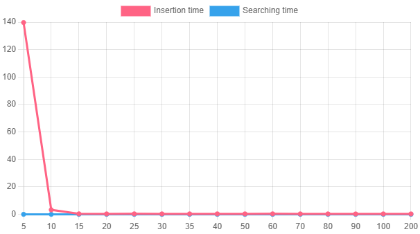

# Esercizio 2
L'esercizio richiede lo sviluppo di una libreria per una struttura dati Skiplist. Si richiede anche un applicazione che implementi tale libreria col fine di correggere le parole di una frase (passata come file) attraverso un dizionario di parole (passato come file), l'applicazione consente di impostare un limite di altezza massima alla skiplist grazie ad un parametro passato da argv (insieme ai file).

# Disposizione in cartelle
La cartella corrente di questa repository contiene le seguenti cartelle:
- skiplist: contiene la struttura dati sviluppata
- main: contiene il sorgente di un'applicazione della struttura dati per il compito richiesto dalla consegna
- bin: contiene il codice compilato dopo l'esecuzione del makefile
- unit_test: contiene la libreria unity per test di unità, un sorgente che implementa la libreria, un makefile per compilare ed eseguire i test

#Relazione

## Configurazione usata per i test
- CPU: Intel Core i7-4790K (x64)
- RAM: 16 GB
- SO: Ubuntu su sottosistema Windows (WSL)

Tabella dei valori:

|Max height|Insertion time|Searching time|
|--|--|--|
|5|139.723342|0.011069|
|10|3.286342|0.000730|
|15|0.388510|0.000342|
|20|0.339409|0.000340|
|25|0.365936|0.000344|
|30|0.343055|0.000362|
|35|0.353767|0.000344|
|40|0.360021|0.000333|
|50|0.360142|0.000347|
|60|0.370446|0.000417|
|70|0.340272|0.000309|
|80|0.339485|0.000343|
|90|0.308508|0.000270|
|100|0.336723|0.000426|
|200|0.329338|0.000344|

Abbassando l'altezza della Skiplist il tempo per l'aggiunta degli elementi incrementa notevolmente. Con un valore di altezza massima fissato ad un intero maggiore o uguale 15 il grafico si stabilizza a un tempo di inserimento pari a circa 0.3 secondi. Il tempo di ricerca non è mai esageratamente alto, ma considerando che passando da un'altezza pari a 10 ad una fissata a 5, il tempo di ricerca aumenta di un fattore pari a 16. Anche il tempo di ricerca per un'altezza maggiore o uguale 15 si stabilizza a circa 0.3 secondi.

La funzione randomica, utilizzata nell'inserimento di un nuovo nodo nella Skiplist, aiuta ad ottenere tali effetti in quanto essa cerca, per quanto possibile, di rendere casuale, ed uniforme, la distruzione degli elementi nella struttura dati. Se l'altezza della Skiplist è fissata ad un valore *basso* rispetto al numero di elementi che si vuole salvare, si avrà una probabilità più alta di formare una sequenza di livelli crescente/decrescente o circa *sullo stesso livello*, facendo collassare la Skiplist in una lista tradizionale.